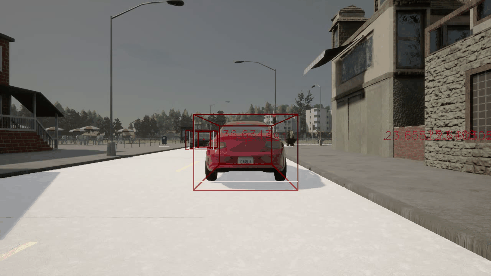

# Carla_dataset_generator

An automatic dataset generator for 2D/3D detection and segment mission based on Carla Simulator.

## Feature

- [x] Support Kitti-like dataset

- [x] Support 2D/3D detection and segment mission

- [ ] Support other dataset

- [ ] Suport other mission

## Result



## Requirement

```
pip install  requirements.txt
```

The project is based on **carla-0.9.12**, which can be download here: [CARLA 0.9.12 Release | CARLA Simulator](http://carla.org/2021/08/02/release-0.9.12/)

And this version of carla seems require **python 3.7**.

## Get Start

All script you need to run is in the Usr folder, and you can set most of the parameter in config.py

### Generate Raw Data

1. Run the Carla Simulator First

2. Run the automatic_control.py

3. Then you should manually check the images which have been generated automatically in order to make the dataset clean, because the Carla Simulator makes some mistakes from time to time.

4. Run the kittiSynchronize.py to make sure that all parts of the dataset is generated synchronously.

### Turn Raw Data into Train Data(Kitti format)

1. Run the jpg2mp4.py

## Output Structure

The generator is designed to produce a kitti-like dataset for now.

```
carla
├─ImageSets
├─testing
│  ├─image_2
│  ├─label_2
│  ├─semantic
│  └─velodyne
├─training
│  ├─image_2
│  ├─label_2
│  ├─semantic
│  └─velodyne
```

## Architecture

```
arla  
├─carla
│  │  requirements.txt
│  │  scene_layout.py
│  │  
│  ├─agents
│  │  │  __init__.py
│  │  │  
│  │  ├─navigation
│  │  │  │  basic_agent.py
│  │  │  │  behavior_agent.py
│  │  │  │  behavior_types.py
│  │  │  │  controller.py
│  │  │  │  global_route_planner.py
│  │  │  │  local_planner.py         
│  │  ├─tools
│  │  │  │  misc.py     
├─examples
│  │  automatic_control.py
│  │  client_bounding_boxes.py
│  │  dynamic_weather.py
│  │  requirements.txt       
├─Usr
│  │  automatic_control.py
│  │  config.py
│  │  depth_cam_utils.py
│  │  findBoundingRect.py
│  │  generateSegLabel.py
│  │  jpg2mp4.py
│  │  kittiDelete.py
│  │  makeImageSets.py
│  │  myDelete.py
│  │  myRecordTest.py
│  │  mySynchronize.py
│  │  kittiSynchronize.py
│  │  parseLLtxt.py
│  │  ply2bev.py
│  │  ply2bin.py
│  │  pos2kitti.py
│  │  position2bev.py         
└─util
    │  check_collisions_substepping.py
    │  check_lidar_bb.py
    │  check_raycast_sensors_determinism.py
    │  config.py
    │  environment.py
    │  lane_explorer.py
    │  performance_benchmark.py
    │  raycast_sensor_testing.py
    │  requirements.txt
    │  test_connection.py
    │  vehicle_physics_tester.py
```

## Contact

If you think this work is useful, please give me a star!  
If you find any errors or have any suggestions, please contact me (**Email:** `sekirorong@gmail.com`).  
Thank you!

## Reference

1. [GitHub - carla-simulator/carla: Open-source simulator for autonomous driving research.](https://github.com/carla-simulator/carla)

2. KITTI: http://www.cvlibs.net/datasets/kitti/raw_data.php
